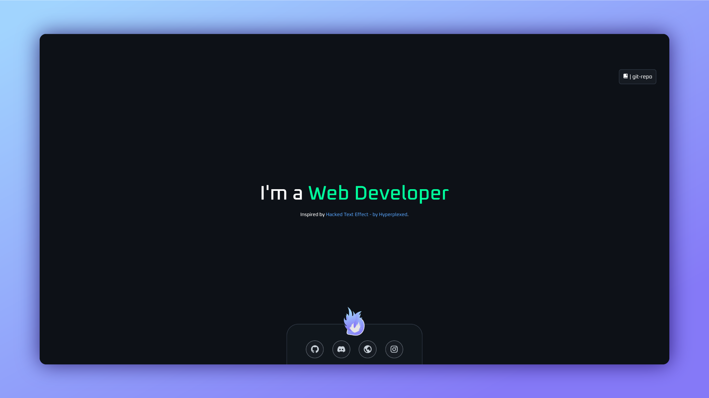

# This a vanilla js plugin that can be used to loop over words with a scramble animation

<!-- ## Table of contents
- [This is repo for my completed frontend mentor challenges.](#this-is-repo-for-my-completed-frontend-mentor-challenges)
  - [Table of contents](#table-of-contents)
  - [Overview](#overview)
    - [Screenshot](#screenshot)
    - [Links](#links)
  - [My process](#my-process)
    - [Built with](#built-with)
    - [What I learned](#what-i-learned)
    - [Continued development](#continued-development)
  - [Author](#author) -->

## Overview

### Live Site Link - [darkidop.github.io/Word-change-with-scramble-effect](https://darkidop.github.io/Word-change-with-scramble-effect)
### Live Site preview


### Built with
- Vanilla js
- HTML
- CSS 


### Usage 
1. Download the [WordScrambleEffect.min.js](https://github.com/DarkidOP/Word-change-with-scramble/blob/main/WordScrambleEffect.min.js) file.
2. add the [WordScrambleEffect.min.js](https://github.com/DarkidOP/Word-change-with-scramble/blob/main/WordScrambleEffect.min.js) file to your page using the script (example below)
```html
<script src="./WordScrambleEffect.min.js"></script>
```
3. add these variables before the script link tag 
```html
<script>
  let scrambleEffectDiv = document.getElementById('text-div'),
  wordsArray = ["Graphics Designer", "Web Developer", "Casual Gamer"],
  animationSpeed = 33,
  animationIntervalSpeed = 1800;
</script>

<script src="./WordScrambleEffect.min.js"></script>
```
Empty example of varible (copy this):
```html
<script>
  let scrambleEffectDiv = document.getElementById(''), // text div id
  wordsArray = [""], // multiple words can be added 
  animationSpeed = 0, // default 0
  animationIntervalSpeed = 0; // default 0
</script>
```

## Author
- Website - [darkid.otakulink.net](https://darkid.otakulink.net)
- Frontend Mentor - [@DarkidOP](https://www.frontendmentor.io/profile/DarkidOP)
- Discord - [! Darkid#1060](https://discord.com/users/522340125380706314)
- Github - [@darkidop](https://github.com/Darkidop)
- Instagram - [@darkidop](https://instagram.com/darkidop)
